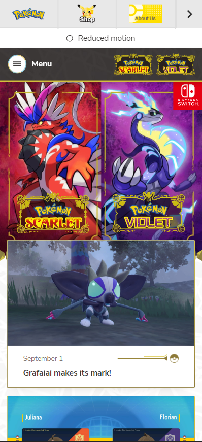
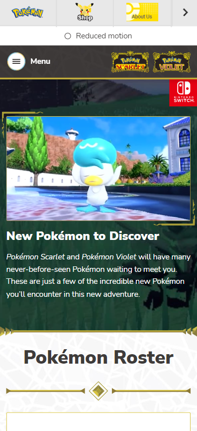

# Procesverslag
Markdown is een simpele manier om HTML te schrijven.  
Markdown cheat cheet: [Hulp bij het schrijven van Markdown](https://github.com/adam-p/markdown-here/wiki/Markdown-Cheatsheet).

Nb. De standaardstructuur en de spartaanse opmaak van de README.md zijn helemaal prima. Het gaat om de inhoud van je procesverslag. Besteedt de tijd voor pracht en praal aan je website.

Nb. Door *open* toe te voegen aan een *details* element kun je deze standaard open zetten. Fijn om dat steeds voor de relevante stuk(ken) te doen.

## Jij

  
uitwerken voor kick-off werkgroep

  ### Auteur:
  Reniet de Vries
  #### Je startniveau:
  Blauw (het liefst streef ik naar Rood toe!)

  #### Je focus:
  Ik kies graag voor het Surface plane. Ik heb een achtergrond in illustratie/vormgeving en het lijkt mij erg interessant om een wel bekende pagina uit te werken met allerlei visuals en animaties.

## Je website

  
uitwerken voor kick-off werkgroep

  ### Je opdracht:
  https://scarletviolet.pokemon.com/en-us/pokemon/

  #### Screenshot(s) van de eerste pagina (small screen): 
  Home menu
  

  #### Screenshot(s) van de tweede pagina (small screen):
  Pokemon rooster
  
 

## Toegankelijkheidstest 1/2 (week 1)

  
uitwerken na test in 1e werkgroep

  ### Mijn Bevindingen:

  #### Screenreader
 Screen reader werkte in principe wel goed. Vaak genoeg kon je de links en headers vinden, en ook het lezen van overige tekst was goed te doen. Foto's en video's hebben ook veel alt tekst waar het tot in detail bespreekt wat er gebeurt in de media.

  #### Muis en Toetsenbord 
  Ging allemaal wel prima, de flow van de website is duidelijk en goed te gebruiken. Hier werken de muis en het toetsenbord dus ook goed bij, ook het doorheen tabben werkt erg simpel en gemakkelijk.

  #### Motoriek (shocks, elastiekjes)

  Spasmes zijn sowieso lastig, vooral het gebruik van knoppen. Toch ga ik deze niet ‘nog groter’ maken dan dat ze al zijn, aangezien het ook vaak gebeurde dat je ergens perongeluk op drukte.

  Wel wil ik dus wat meer ruimte tussen meerdere knoppen of andere elementen.

  #### Visueel (brillen, contrast, kleurenblind, dark/light). 

Terwijl Stephan slechtziend was had hij moeite met hoe licht de website was. Het contrast was nogal groot, dus behoefte aan een dark mode of iets dergelijks is wellicht iets om naar te kijken.

Verder: Knoppen zijn duidelijk, gebruik van donkere kleuren in menu’s zijn fijn, etc.

## Breakdownschets (week 1)

  
uitwerken na afloop 2e werkgroep

  ### de hele pagina: 
  

   ### de hele pagina: 
  

Ik heb 1 dynamisch deel, in dit geval het hamburger menu. Deze wil ik graag een breakdown geven na de JS les.

## Voortgang 1 (week 2)

  
uitwerken voor 1e voortgang

  Ik heb tot nu toe vooral nog vragen over het schrijven van correcte semantiek, en ook vragen over positionering. Wanneer is het namelijk verstandig om flexbox te gebruiken? Of kan ik daar beter voor position voor gebruiken? Hier twijfel ik af en toe nog over.

  ### Stand van zaken
Tijdens het bespreken met de studenten assistenten had ik meer uitleg gekregen over positionering en besloot ik ook bepaalde elementen met flexbox te positioneren, i.p.v. position absolute of juist andersom.

  ### Agenda voor meeting

Atakan- Atakan wilde ook graag meer weten over het positioneren en de juiste semantiek.
Kacper- Kacper was de dag van de meeting ziek, maar was er wel bij het feedback gesprek. Bij hem ging het ook veel over het positioneren.
Klaudia- Niks van gehoord, hoogst waarschijnlijk ziek.

  ### Verslag van meeting
  
  Ik ging samen met Nina aan de slag om mijn code te bekijken en ik stelde vragen waar nodig. Ik kon lekker doorwerken en had een beter gevoel over m'n code toen ik de klas uit liep. Ymaro en Laurens hielpen Atakan en Kacper, ook dat leek goed te gaan.

## Voortgang 2 (week 3)

  
uitwerken voor 2e voortgang

  ### Stand van zaken
Deze week ben ik erg benieuwd naar de feedbackrondes, aangezien ik deze x met Vasilis ga zitten. Ik heb veel aan de look van mijn website kunnen doen en de 1ste pagina is al bijna af. Dan door naar pagina 2, ik denk dat dat ook wel snel moet lukken.

  ### Agenda voor meeting
  samen met je groepje opstellen
  
Atakan- Atakan ging lekker met zijn website, ook hij wilde graag weten wat Vasilis te zeggen had.
Kacper- Kacper was er de dag van de feedbackronde zelf niet bij.
Klaudia- Niks van gehoord, hoogst waarschijnlijk ziek.

  ### Verslag van meeting
De feedback van Vasilis was erg nuttig! Hij was enthousiast om te zien hoe het allemaal ging en gaf fijne uitleg over de dingen waar ik zelf nog niet helemaal zeker van was.

  - Hij vertelde mij dat ik helemaal niet veel JS nodig had om bepaalde functies in elkaar te draaien. (in dit geval een back to top button)
  - Het enthousiasme van Vasilis gaf mij een kleine confidence boost, vooral ook omdat ik graag met animaties aan de slag wil.

## Toegankelijkheidstest 2/2 (week 4)

  
uitwerken na test in 8e werkgroep

  ### Mijn Bevindingen:

  #### Screenreader
De screenreader werkte goed op de website, behalve op het hamburgermenu. Daar werden de links niet weergeven, maar wel opgenoemd. (dus naar deze links kon je navigeren, maar worden niet getoond op de monitor.)

- Seperators worden voorgelezen (HR), nogal vervelend.
- Social media iconen hebben geen alt tekst.

  #### Muis en Toetsenbord 
Door de site tabben is nog steeds goed te doen. De buttons werken ook zoals bedoeld en de navigatie zelf verloopt netjes. Wel wil ik het zelf nog wat opleuken met animaties, maar dat heeft niet zo veel met accessibility te maken.

  #### Motoriek (shocks, elastiekjes)
Gebruiken van de site met motorieke problemen is nog best goed te doen, alleen moet er aandacht besteedt worden aan bepaalde knopjes. Gelukkig zijn meeste list items zelf groot genoeg om comfortabel op te klikken.

- Label van hamburgermenu opende het menu niet
- Ook mogen de hamburger items wat groter, klikt makkelijker.

  #### Visueel (brillen, contrast, kleurenblind, dark/light). 
Het contrast van de site werkt fijn, voor elke soort kleurenblindheid. Elementen zijn groot en verschillend genoeg om ook met blurred vision goed te werken. Dark mode wil ik nog wel toepassen, maar het is niet het geval dat de light theme vreselijk is om naar te kijken.

- Dark mode toevoegen

## Voortgang 3 (week 4)

  
uitwerken voor 3e voortgang

  ### Stand van zaken
Mijn site is bijna af. Ik heb wel nog wat vragen wat betreft JS, dus ik ga daar een student assistent over spreken. Ik heb namelijk geen idee hoe ik die gallery ga opzetten (slide-able pokemon)

  ### Agenda voor meeting
  
Atakan- Atakan had niets te bespreken, wilde verder werken en vragen stellen indien nodig.
Kacper- Kacper had al vaker met Laurens gesproken en wilde met hem verder werken.
Klaudia- Niks van gehoord, hoogst waarschijnlijk ziek.

  ### Verslag van meeting
Ymaro en ik gingen aan de slag met JS, al vond ik het lastig bij te houden. Bepaalde stukken van de code snapte ik wel, maar uiteindelijk werd het best veel code voor een 'simpele' functie. We hebben besloten om die avond nog een belletje te plegen.

  - bellen met Ymaro over de gallery

## Eindgesprek (week 5)

  
uitwerken voor eindgesprek

  ### Je uitkomst - karakteristiek screenshots:
  

  ### Dit ging goed/Heb ik geleerd: 
  Korte omschrijving met plaatjes

  

  ### Dit was lastig/Is niet gelukt:
  Korte omschrijving met plaatjes

  

## Bronnenlijst

  
continu bijhouden terwijl je werkt

* Code * :

CSS selectors https://www.w3schools.com/cssref/css_selectors.asp
IntersectionObserver https://developer.mozilla.org/en-US/docs/Web/API/IntersectionObserver/observe

Ook veel toegepast van de slides op DLO en de bijbehorende Codepen opdrachten.

* Visuals * :

Alle visuals zijn gevonden op de website zelf. - https://scarletviolet.pokemon.com/en-us/pokemon/

* Audio * :

Sprigatito audio - https://www.youtube.com/watch?v=CXEsmh_GawU&ab_channel=RandomInkNStuff
Fuecoco audio - https://www.youtube.com/watch?v=4zvwDJ4f6cE&ab_channel=SailorNeptune
Quaxly audio - https://www.youtube.com/watch?v=0gMoY4sIQdQ&ab_channel=SailorNeptune
Koraidon audio - https://www.youtube.com/watch?v=x4OCTFm9BtY
Miraidon audio - https://www.youtube.com/watch?v=VZ_ZeaVKRLs&ab_channel=MostlyPokemonGirlfriendCries

